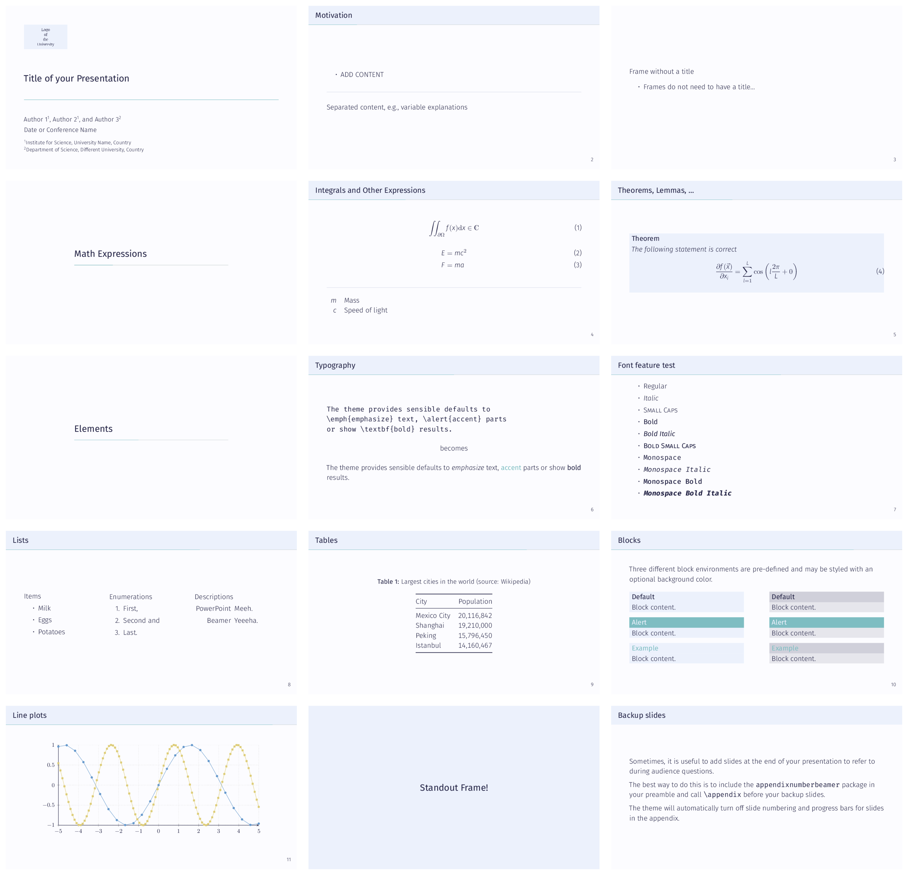

# Clean and Simple Beamer Presentation Template

This repository provides a clean and simple template for presentations made
with the LaTeX [beamer package](https://ctan.org/pkg/beamer).
The design is based on the [metropolis theme](https://github.com/matze/mtheme).

It is highlighted by many guides on good slide design that slides should
contain no clutter and as few objects as possible.
Jean-luc Doumont says the following about slide templates in his talk about
[Creating effective slides](https://youtu.be/meBXuTIPJQk?t=2200):
> A template is a way to specify where the content should come and how the
> content should look once it comes there.  
> As long as you don't have content, there should be nothing.


# Installation
## On GitHub
Click on ["Use this template"](https://github.com/new?template_name=beamer-presentation-template&template_owner=klb2).

## Local Installation
Simply copy all of the `*.tex` files into a new folder.
Alternatively, you can use the
[`mkbeamerprsentation.sh`](mkbeamerprsentation.sh) script to automatically do
this for you.
The following command will create a new directory `name-of-the-paper-directory`
with the template and initialize a new Git repository.

```bash
bash mkbeamerprsentation.sh name-of-the-paper-directory
```

## Requirements
Make sure that you have a LaTeX installation on your computer, which includes
the [metropolis theme](https://ctan.org/pkg/beamertheme-metropolis). It should
be included in every popular LaTeX distribution like TeX live or MiKTeX.

If you want to use the [Fira fonts](https://github.com/mozilla/Fira), you need
to install them on your machine first.


# Usage
The file `presentation.tex` is the main file that needs to be compiled. It is
recommended to use `lualatex`, if you want to use the Fira fonts that are the
default fonts in the metropolis theme.


# Customization
## Colors
The template allows an easy customization of the colors and styles according to
your needs.
In particular, you only need to edit the color definitions in the
[`setup-colors.tex`](setup-colors.tex) file.

There are four colors in this theme which you can adjust to your needs:
```latex
\definecolor{accent}{HTML}{7EBDC2} % accent color
\definecolor{bgcolor}{HTML}{FCFCFF} % background color
\definecolor{bgcolorAlt}{HTML}{ECF1FC} % alternative/second background color
\definecolor{fgcolor}{HTML}{222244} % foreground/text color
```

`accent`
: Accent color that is used for the progress bar and `\alert{text}`.

`bgcolor`
: Main background color that is used as the background color of the slides.

`bgcolorAlt`
: Second/alternative background color that is used as the background color of
the slide titles and as the background color for boxes.

`fgcolor`
: Foreground color that is used as the text color.

## Logo
If you want to show the logo of your institution/university on the title page,
you simple need to adjust the `\titlegraphic` command like
```latex
\titlegraphic{\includegraphics[height=.17\textheight]{logo.png}}
```
where `logo.png` refers to the image file of the logo.

# Example
The following image shows the provided example slides with an example color
scheme.


